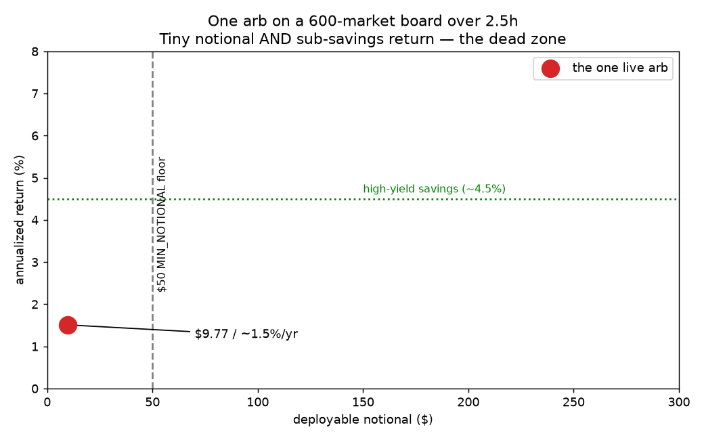
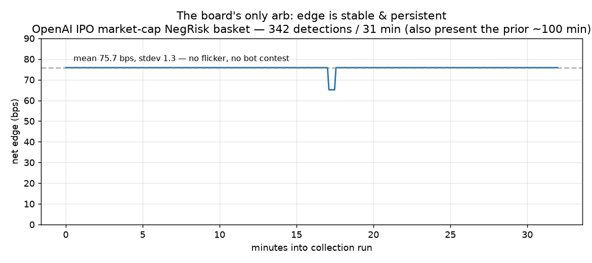
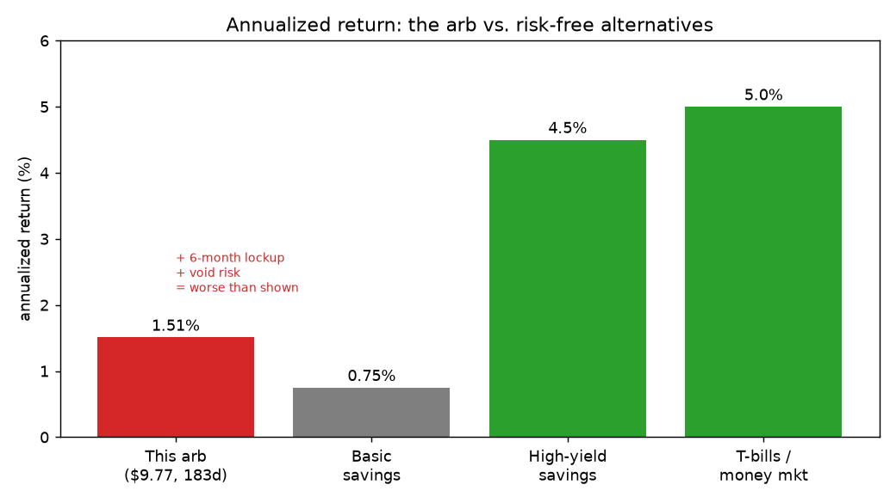

# Should we lower the `MIN_NOTIONAL` floor?

**A data-driven analysis with a statistician-committee verdict**
*polyarb · 2026-07-01 · read-only live observation, full 600-market board, WebSocket-first*

---

## TL;DR

**No. Keep `MIN_NOTIONAL` at $50.** The committee is unanimous across three independent lenses.

The premise behind the question — *"we're dropping lots of small-but-real edges"* — does not survive the data. Over **~2.5 hours of continuous observation**, the entire board held **exactly one** structural arbitrage: a ~$9.77, ~1.5%/yr, 183-day NegRisk basket. The "~1,011 dropped opportunities" were **1,011 re-detections of that same one opp**, not 1,011 distinct edges. Lowering the floor from $50 to $1 revealed **zero** additional opportunities.

Three concrete follow-ups the committee *does* endorse:
1. **Add an annualized-return gate** (~8–10%/yr) — the real economic filter a notional floor can't express.
2. **Make executability the gate, not just notional** — verify per-leg order minimums / real depth before trusting any sub-$50 basket.
3. **Run a 2–4 week shadow-ledger experiment** (the E1 ledger now makes this trivial) before *ever* revisiting the floor — decide on an arrival *rate*, not on n=1.

---

## 1. The question and the premise

The scanner drops candidates that fall below `MIN_NOTIONAL` ($50) or `MIN_PROFIT_BPS` (30 bps). A live run showed **1,011 `below_notional` drops** and **0 `below_profit`** drops — every rejection was for *size*, not *quality*. That looked like "the floor is costing us a volume of small, real edges." So we lowered the floor to $1 and recorded everything to the E1 ledger to measure what we'd been missing.

## 2. Method

- **Monitoring run** (`MIN_NOTIONAL=$50`): ~100 min, the scanner's normal config, candidates filtered as usual.
- **Collection run** (`MIN_NOTIONAL=$1`, `DEDUPE_COOLDOWN=0`): ~31 min, every sub-$50 candidate *kept* and written to the E1 `economic_events` ledger every pass — so re-detections dedupe to distinct economic events by fingerprint, and `detection_count` + first/last-seen measure persistence.
- Read-only throughout; no orders, no signing client. Data pulled from the container's SQLite (`/data/polyarb.db`) and the structured logs.

## 3. What the data actually shows

### 3.1 It was one opportunity — not a thousand

| Metric | Value |
|---|---|
| Raw detections (collection run) | 342 |
| **Distinct economic events (deduped)** | **1** |
| Detector / market | `negrisk_basket` · "OpenAI IPO Closing Market Cap" (7 buckets) |
| Net edge | **75.7 bps** (min 65.1, max 75.8, **stdev 1.3**) |
| Deployable notional | **$9.77** (size 10 × $0.977/set) |
| Time to resolution | **183 days** |
| **Annualized return** | **~1.5%/yr** |
| Absolute profit | **~$0.07** |

Lowering `$50 → $1` surfaced **no new opps**. The floor was never the binding constraint — the board is simply near arb-free right now.



### 3.2 The edge is stable and persistent — for ~2.5 hours

The mispricing was present **continuously**: 1,089 of 1,091 passes over the ~100-min monitoring run (2 gaps = startup + one reconnect), then 342/342 passes over the 31-min collection run. Zero flicker; the edge barely moved (stdev 1.3 bps on ~75).



This persistence is the crux of the HFT question — see §4.2, where the committee reads it two very different ways.

### 3.3 It's a sub-savings-account return

~1.5%/yr, capital locked for 6 months, with void/resolution risk — versus a liquid, risk-free ~4.5% high-yield savings account.



On the ~$9.77 you could deploy, this earns **~$0.07** over 183 days. The same cash in a 4.5% HYSA earns **~$0.20** over that period — **~3× more, liquid, and risk-free.** Risk-adjusted (a void forfeits ~183 days of ~5% risk-free ≈ a ~$0.24 opportunity cost, *larger than the entire edge*), the trade is **negative expected value versus just holding cash.**

---

## 4. The statistician committee

Three independent Opus reviewers, each a distinct adversarial lens, fed the real data. **All three said do not lower the floor.**

### 4.1 Capital-efficiency lens — *"the gate is measuring the wrong thing"*
> **Verdict: do not lower.** 75.7 bps looks great and 1.5%/yr looks terrible — *same trade*. A raw-bps/notional floor is blind to lockup duration, the dominant variable for resolution-only arbs. This edge is dominated by T-bills (~5%), money-market, even a HYSA — all more liquid, near-zero risk, zero attention. Risk-adjusted it's **negative EV vs cash**. The "volume of small real edges" thesis is falsified for this regime. **Fix: add an annualized-return gate (~8–10%/yr = T-bill + a spread for void/illiquidity/attention) as the *primary* economic filter; keep $50 as a secondary dust floor.** Confidence: high. *Caveat: if execution were fully automated and truly $0-cost, even 1.5%/yr on otherwise-idle capital beats a 0% mattress — but still loses to T-bills, so the annualized gate still binds.*

### 4.2 Microstructure / execution lens — *"the persistence is the tell"*
> **Verdict: keep $50.** In a bot-watched venue, a genuinely grabbable 76-bps risk-free edge on a $500M-attention name (OpenAI IPO) is taken in *seconds*, not hours. A 2.5h zero-flicker, zero-drift edge means **the resting asks are not fillable size** — stale/placeholder liquidity that quotes a price but won't clear a real 7-leg sweep. Execution reality of a ~$9.77 / 7-leg basket ≈ **$1.40 and ~1.4 shares per leg** — likely below Polymarket's per-leg minimum order size, and rounding legs up to the minimum breaks the basket ratios. The reported `executable_size=10` is the *optimistic* atomic-fill ceiling; the honest `conservative_size` (thinnest leg's best-level depth) is likely 1–2 sets on a 183-day market. **Lowering the floor surfaces edges that are *visible* but not *capturable* — i.e. false positives, the stated enemy.** Confidence: high. *Biggest risk: inferred from code, not a live 7-book pull — verify the per-leg minimum before trusting any sub-$50 basket.*

### 4.3 Statistical-inference lens — *"n=1, not n=1,000"*
> **Verdict: do not lower — the evidence can't decide either way.** The premise commits a **pseudoreplication error**: ~1,011 sub-$50 "drops" are ~1,011 re-observations of *one* persistent mispricing sampled every 5s — effective **n=1**, not ~1,000. Re-detections of a static book are ~perfectly autocorrelated and carry ~zero information about the *arrival* of new edges. One mid-day window on one day also can't see event-driven edges (news, partial resolutions, volatility) — and quiet hours bias the count *downward*. **Don't decide on n=1.** The E1 ledger now makes the right experiment cheap: run a $1 *shadow* floor (log-only, still read-only) for ≥2–4 weeks, measure the **distinct-opp arrival rate** in the $1–$50 band stratified by time-of-day / weekday / event-proximity, with a Poisson CI, and only revisit if the rate clears a pre-registered threshold. Confidence: high. *Biggest risk: acting on autocorrelated n=1 admits marginal/false-positive opps — worsening the very metric the operator most fears.*

---

## 5. Synthesis — the ranked verdict

The three lenses attack from different directions and arrive at the same place, which is the strongest kind of agreement. Ranked by how decisive each is:

1. **Execution (most decisive):** the edge is very likely *not capturable* at all — the 2.5h persistence + $1.40/leg economics point to stale liquidity below exchange minimums. Lowering the floor would surface phantom edges. This alone settles it.
2. **Capital-efficiency:** *even if* it were capturable, ~1.5%/yr locked for 6 months is negative-EV versus risk-free cash. The right filter is an **annualized-return gate**, which a notional floor cannot express.
3. **Inference:** *even setting both aside*, we have **n=1** — no basis to conclude the floor costs us volume. The honest move is to measure the arrival rate, not to change a gate on a single autocorrelated observation.

There is no reading of the data under which lowering `MIN_NOTIONAL` is the right move.

## 6. Recommendations — how to proceed

**Do now:**
- **Keep `MIN_NOTIONAL = $50`.** No change. The floor is not the binding constraint; liquidity and annualized economics are.
- **Correct the mental model:** the board is *near arb-free* right now (spread-locked). "1,011 dropped" = one opp re-counted. The bottleneck is edge *supply*, not the floor.

**Build next (in priority order):**
1. **Annualized-return gate** — add `min_annualized_return` (~8–10%/yr) as a first-class filter alongside `MIN_NOTIONAL`. This is the economically correct test for held-to-resolution arbs and would reject this OpenAI basket for the right reason. *(Small: the ledger + `annualized` field already exist.)*
2. **Executability gate** — before trusting any sub-$50 (indeed any) basket, gate on `conservative_size` (thinnest-leg depth) and enforce per-leg minimum order size (backlog **D5**). Verify Polymarket's live per-leg minimum with a real 7-book pull. This turns "visible" into "capturable."
3. **Shadow-ledger experiment** — run a **$1 log-only shadow floor** (read-only) for **2–4 weeks**, recording distinct-opp arrivals in the $1–$50 band via the E1 ledger, stratified by time-of-day / weekday / event-proximity. **This is the only thing that can actually answer "does small-edge volume exist?"** — and the E1/E2 plumbing we just built makes it nearly free.

**Decision rule to revisit the floor:** only reconsider lowering `MIN_NOTIONAL` if the shadow ledger shows a **statistically stable distinct-opp arrival rate** in the sub-$50 band, **above a pre-registered threshold**, across **≥2 market conditions** — *and* those opps clear the executability gate (§6.2) and the annualized gate (§6.1). Absent that, the floor stays.

---

## Appendix — raw statistics

```
Observation window : 2026-07-01 12:47–14:58 UTC (~2.5h continuous, read-only)
Board size         : 600 markets (full live board), WebSocket-first
Monitoring run     : MIN_NOTIONAL=$50 · edge present 1089/1091 passes (~100 min); 2 gaps (startup + 1 reconnect)
Collection run     : MIN_NOTIONAL=$1, DEDUPE=0 · 342 detections / 31 min
Distinct opps      : 1  (E1 ledger, deduped by economic fingerprint)
  detector/market  : negrisk_basket · "OpenAI IPO Closing Market Cap" (7 buckets)
  net edge         : mean 75.7 bps, min 65.1, max 75.8, stdev 1.3
  size / notional  : 10 / $9.77
  days-to-resolve  : 183   →   annualized ≈ 1.51%/yr
  abs. profit      : ~$0.07   (vs ~$0.20 for the same $9.77 in a 4.5% HYSA over 183d)
WS stability       : 1 connection, 1 auto-recovered reconnect (~1.1s), 0 scan failures
```

*Committee: 3 independent Opus reviewers (capital-efficiency · market-microstructure/execution · statistical-inference), run in parallel, synthesized here. Charts generated from the live SQLite ledger + structured logs.*
